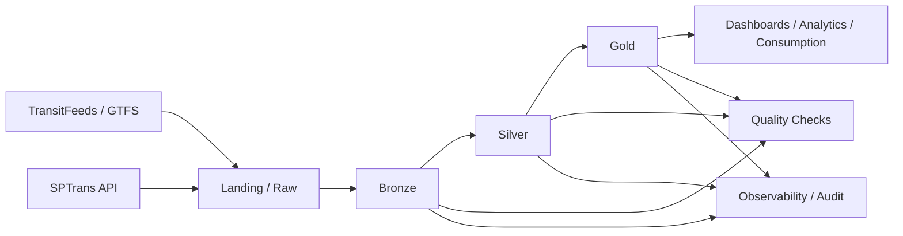
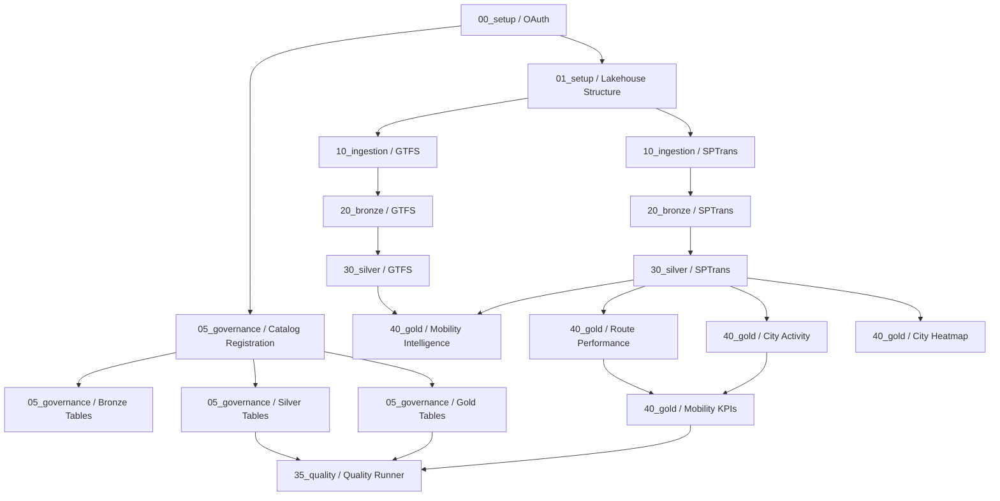

# sp-mobility-data-platform

Plataforma de engenharia de dados para mobilidade urbana em Sao Paulo, construída em Azure + Databricks com arquitetura Lakehouse e modelagem Medallion. O projeto integra dados GTFS e posições de veículos SPTrans, transforma esses dados em camadas analíticas e publica datasets Gold com foco em inteligência operacional e analytics.

## Visão geral

Este projeto foi estruturado como um case de engenharia de dados profissional, com foco em:

- ingestão de múltiplas fontes
- processamento em camadas Bronze, Silver e Gold
- governança e rastreabilidade
- data quality
- observabilidade
- infraestrutura como código
- orquestração em Databricks Jobs

## Stack

- Cloud: Azure
- Storage: ADLS Gen2
- Processamento: Databricks
- Engine: Apache Spark
- Tabelas: Delta Lake
- Orquestração: Databricks Jobs
- Infraestrutura: Terraform
- CI/CD: GitHub Actions

## Arquitetura



## Pipeline



## Camadas de dados

### Landing / Raw

Responsável por receber os dados de origem sem transformação relevante.

- GTFS estático
- snapshots da API SPTrans

### Bronze

Responsável por estruturar os dados brutos em Delta Lake, preservando granularidade e histórico.

- `gtfs_agency`
- `gtfs_calendar`
- `gtfs_routes`
- `gtfs_shapes`
- `gtfs_stop_times`
- `gtfs_stops`
- `gtfs_trips`
- `sptrans_vehicle_positions`

### Silver

Responsável por padronização, limpeza e enriquecimento.

- `gtfs/shapes`
- `gtfs_trips_enriched`
- `sptrans/vehicle_positions`

### Gold

Responsável por datasets analíticos orientados ao consumo.

- `mobility/intelligence`
- `route_performance`
- `city_activity`
- `map/city_heatmap`
- `mobility_kpis`

## Fontes de dados

### GTFS

- origem principal: TransitFeeds
- comportamento operacional validado: fallback local quando a origem remota retorna `403 Forbidden`

Fallback utilizado no workspace validado:

- `/Workspace/Users/slaxdataengineer@outlook.com/sp-mobility-data-platform/data/raw/gtfs/cittamobi_gtfs.zip`

### SPTrans

- origem: API SPTrans
- uso de token armazenado em secret scope do Databricks

## Estrutura do repositório

```text
config/                  configuracoes por ambiente
data/                    dados locais de apoio e fallback
docs/                    arquitetura e decisoes
governance/              dicionario, policies, contracts, lineage e DDL
jobs/                    definicoes de jobs Databricks
notebooks/               notebooks por camada funcional
observability/           utilitarios de auditoria e observabilidade
terraform/               infraestrutura como codigo
tests/                   testes unitarios, integracao e quality
workflows/               definicoes de pipelines e workflows
```

## Configuração de ambiente

Antes da execução, o ambiente Databricks precisa ter:

- acesso ao ADLS Gen2
- acesso aos notebooks no Workspace
- secret scope `kv-sp-mobility`
- cluster `sp-mobility`

Cluster validado:

- nome: `sp-mobility`
- cluster id: `0323-121133-n0dnzyjm`

## Secrets necessários

No scope `kv-sp-mobility`, os seguintes secrets devem existir:

- `databricks-sp-client-id`
- `databricks-sp-secret`
- `databricks-sp-tenant-id`
- `sptrans-api-token`

## Jobs e orquestração

Job validado:

- nome: `sp-mobility-pipeline`
- job id: `847346803592537`

Artefatos principais:

- [jobs/sp_mobility_job.json](/Users/leandrosantos/Downloads/sp-mobility-data-platform/jobs/sp_mobility_job.json)
- [jobs/sp_mobility_job_update.json](/Users/leandrosantos/Downloads/sp-mobility-data-platform/jobs/sp_mobility_job_update.json)
- [workflows/jobs/sp_mobility_lakehouse_pipeline.yml](/Users/leandrosantos/Downloads/sp-mobility-data-platform/workflows/jobs/sp_mobility_lakehouse_pipeline.yml)

O job foi estabilizado para usar `existing_cluster_id` do cluster `sp-mobility`, evitando falhas de provisionamento do `job_cluster` efêmero.

## Execução validada no Databricks

Execução manual validada nesta ordem:

1. `notebooks/00_setup/00_adls_gen2_oauth_connection`
2. `notebooks/00_setup/01_create_lakehouse_structure`
3. `notebooks/05_governance/00_governance_catalog_registration`
4. `notebooks/05_governance/01_create_delta_tables_bronze`
5. `notebooks/05_governance/02_register_silver_tables`
6. `notebooks/05_governance/03_register_gold_tables`
7. `notebooks/10_ingestion/02_ingest_gtfs_static_data`
8. `notebooks/20_bronze/03_bronze_gtfs`
9. `notebooks/30_silver/04_silver_gtfs`
10. `notebooks/10_ingestion/09_ingest_sptrans_vehicle_positions`
11. `notebooks/20_bronze/10_bronze_sptrans_vehicle_positions`
12. `notebooks/30_silver/11_silver_sptrans_vehicle_positions`
13. `notebooks/40_gold/13_gold_sptrans_mobility_intelligence`
14. `notebooks/40_gold/22_gold_route_performance`
15. `notebooks/40_gold/23_gold_city_activity`
16. `notebooks/40_gold/24_gold_city_heatmap`
17. `notebooks/40_gold/25_gold_mobility_kpis`
18. `notebooks/35_quality/05_quality_runner`

Resultado validado:

- pipeline ponta a ponta executando com sucesso
- quality runner executando com sucesso
- job Databricks executando com sucesso

## Observabilidade

O projeto já possui uma base de observabilidade com auditoria de pipeline e artefatos dedicados.

Itens presentes:

- utilitário [pipeline_audit.py](/Users/leandrosantos/Downloads/sp-mobility-data-platform/observability/pipeline_audit.py)
- notebook de observabilidade em `notebooks/45_observability`
- documentação em [governance/audit/pipeline_audit.md](/Users/leandrosantos/Downloads/sp-mobility-data-platform/governance/audit/pipeline_audit.md)

Práticas aplicadas:

- auditoria por execução
- separação de artefatos operacionais
- base para métricas de pipeline e troubleshooting

## Data Quality

O projeto inclui camada dedicada de qualidade de dados em `notebooks/35_quality`.

Checks validados:

- qualidade de `silver_sptrans_vehicle_positions`
- qualidade de `silver_gtfs_trips_enriched`
- qualidade de `gold_city_activity`
- qualidade de `gold_mobility_kpis`

Artefatos relacionados:

- [governance/quality/data_quality_rules.md](/Users/leandrosantos/Downloads/sp-mobility-data-platform/governance/quality/data_quality_rules.md)
- [governance/data_contracts/vehicle_positions_contract.yaml](/Users/leandrosantos/Downloads/sp-mobility-data-platform/governance/data_contracts/vehicle_positions_contract.yaml)

## Governança

O projeto inclui artefatos de governança além da simples implementação técnica.

Itens presentes:

- dicionário de dados
- políticas de acesso
- classificação de dados
- retenção
- ownership
- linhagem
- contratos de dados
- DDL por camada

Referências:

- [governance/README.md](/Users/leandrosantos/Downloads/sp-mobility-data-platform/governance/README.md)
- [governance/lineage/mobility_lineage.md](/Users/leandrosantos/Downloads/sp-mobility-data-platform/governance/lineage/mobility_lineage.md)

## Infraestrutura como código

O provisionamento de recursos está organizado em Terraform por ambiente e por módulo.

Estrutura:

- `terraform/environments/dev`
- `terraform/environments/prod`
- `terraform/modules/resource_group`
- `terraform/modules/storage`
- `terraform/modules/keyvault`
- `terraform/modules/databricks`

Observação:

- a documentação de Terraform ainda pode ser expandida em [terraform/README.md](/Users/leandrosantos/Downloads/sp-mobility-data-platform/terraform/README.md)

## CI/CD

O projeto já possui workflows de CI/CD em GitHub Actions:

- [ci.yml](/Users/leandrosantos/Downloads/sp-mobility-data-platform/.github/workflows/ci.yml)
- [cd.yml](/Users/leandrosantos/Downloads/sp-mobility-data-platform/.github/workflows/cd.yml)

Cobertura atual:

- validação básica de sintaxe Python
- checagem de padrões proibidos em notebooks
- lint inicial
- deploy de notebooks para Databricks em branch principal

Melhorias recomendadas para próxima fase:

- falhar lint de forma estrita
- validar Terraform
- adicionar testes unitários e de integração
- separar deploy por ambiente
- adicionar política de promoção entre branches

## Como executar pela CLI

Atualizar o job:

```bash
databricks jobs reset --json @jobs/sp_mobility_job_update.json
```

Executar o job:

```bash
databricks jobs run-now 847346803592537
```

Consultar a definição atual do job:

```bash
databricks jobs get 847346803592537
```

Consultar um run:

```bash
databricks jobs get-run <run_id>
```

## Troubleshooting

### Erro de `%run` no Databricks

Os notebooks principais foram estabilizados para evitar dependência frágil de `%run` relativo no fluxo crítico de execução.

### Erro de notebook não encontrado

O job deve apontar para paths em:

- `/Workspace/Users/slaxdataengineer@outlook.com/sp-mobility-data-platform/...`

### Erro de secret inexistente

Confira os secrets do scope:

```bash
databricks secrets list-secrets kv-sp-mobility
```

### Job travado em `Waiting for cluster`

O problema foi mitigado ao substituir `job_cluster` efêmero pelo cluster existente `sp-mobility`.

## Estado atual do projeto

O projeto já demonstra:

- arquitetura em camadas
- orquestração real em Databricks
- integração com ADLS via OAuth
- governança
- quality
- observabilidade inicial
- CI/CD inicial
- infraestrutura como código

## Próximos passos

Para elevar o projeto ao nível máximo de portfólio, os próximos passos recomendados são:

- criar testes unitários e de integração reais
- fortalecer CI com validações estritas
- expandir documentação de arquitetura e ADRs
- evoluir observabilidade com métricas e alertas
- documentar dashboards e evidências visuais de consumo
- revisar higiene de repositório e artefatos de Terraform
