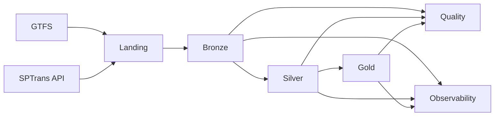

# Architecture

## Contexto

A plataforma foi desenhada para processar dados de mobilidade urbana em uma arquitetura Lakehouse no Databricks, combinando ingestão batch de GTFS com ingestão recorrente de posições de veículos SPTrans.

## Princípios arquiteturais

- separação por camadas Bronze, Silver e Gold
- armazenamento em ADLS Gen2 com Delta Lake
- notebooks especializados por etapa do pipeline
- orquestração por Databricks Jobs
- governança e quality como partes do fluxo, não como pós-processamento

## Componentes principais

### Fontes

- GTFS estático
- API SPTrans

### Armazenamento

- `landing`: recebimento inicial
- `bronze`: estruturação bruta
- `silver`: padronização e enriquecimento
- `gold`: datasets analíticos
- `checkpoint`: suporte a processamento e controle operacional

### Processamento

- notebooks Databricks para setup, governança, ingestão e transformações
- Spark para leitura, transformação e gravação
- Delta Lake para persistência analítica

### Governança

- DDL versionado
- dicionário de dados
- políticas
- contratos de dados
- lineage

### Operação

- quality runner para validações finais
- pipeline audit para trilha operacional
- GitHub Actions para validações de CI

## Fluxo arquitetural

## Decisões relevantes

- uso de cluster existente `sp-mobility` para estabilizar a execução do job
- padronização dos notebooks operacionais em `/Workspace/Users/...`
- fallback local para GTFS em caso de indisponibilidade da fonte remota
- priorização de configuração por widget e por ambiente

## Estado atual

Arquitetura validada em execução real no Databricks, com job operacional ponta a ponta.
